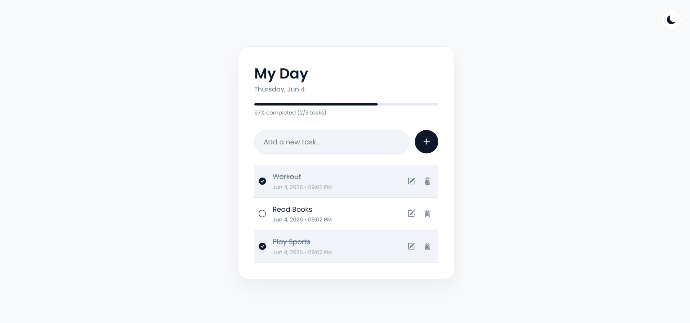

# 📝 To-Do List

A clean and modern To-Do List application built with **HTML, CSS, and JavaScript**. This project helps users organize daily tasks, track progress, and switch between Light and Dark themes.

## ✨ Features

* ➕ Add new tasks
* ✅ Mark tasks as completed
* ✏️ Edit existing tasks
* 🗑️ Delete tasks
* 📊 Task completion progress bar
* 🌙 Light/Dark mode toggle
* 💾 Local Storage support (tasks are saved automatically)
* 📅 Automatic task timestamp
* 📱 Responsive design for desktop and mobile

## 📸 Preview



> Add your own screenshot and save it as `screenshot.png` in the repository root.

## 🛠️ Technologies Used

* HTML5
* CSS3
* JavaScript (ES6)
* Bootstrap Icons
* Google Fonts (Poppins)

## 📁 Project Structure

```text
todo-app/
│
├── index.html
├── style.css
├── script.js
├── screenshot.png
└── README.md
```

## 🚀 Getting Started

### 1. Clone the repository

```bash
git clone https://github.com/PhanathEM/ToDoList-Project.git
```

### 2. Open the project

Navigate to the project folder:

```bash
cd ToDoList-Project
```

### 3. Run the application

Simply open:

```text
index.html
```

in your browser.

No installation or dependencies are required.

## 📖 How It Works

### Adding a Task

1. Enter a task in the input field.
2. Click the "+" button.
3. The task will be saved automatically.

### Completing a Task

* Click on a task to mark it as completed.
* The progress bar updates automatically.

### Editing a Task

* Click the pencil icon.
* Update the task text.
* Press Enter or click the check icon.

### Deleting a Task

* Click the trash icon to remove a task permanently.

### Theme Switching

* Click the moon/sun icon in the top-right corner.
* Your preferred theme is saved in Local Storage.

## 💾 Local Storage

This application stores:

* Tasks
* Completion status
* Theme preference

using the browser's Local Storage API.

## 🎯 Learning Objectives

This project demonstrates:

* DOM Manipulation
* Event Handling
* Local Storage
* Responsive Design
* Theme Management
* CRUD Operations
* JavaScript Arrays and Objects

## 🤝 Contributing

Contributions, issues, and feature requests are welcome.

Feel free to fork the repository and submit a pull request.

## 📄 License

This project is for educational and portfolio purposes.

## 👨‍💻 Author

Developed by **Phanath EM**

